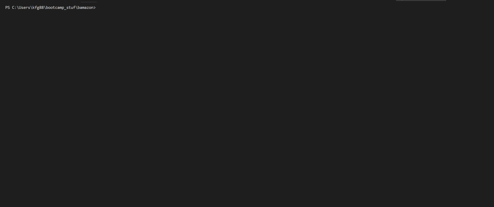

# bamazon

This app was made to mock an online shopping service cleverly named Bamazon. This is a CLI App that has three different view points of the
store, Customer, Manager, and Supervisor. This three different views give the user the ability to change the inventory and sales of the store
in different ways. 

-----------------------------------------------

## Preparing the App for use 

Using terminal or similar programs, run 

#### `npm install`

to pull the external npm packages required to run the app.

 *[Inquirer](https://www.npmjs.com/package/inquirer)
 
 *[MySQL](https://www.npmjs.com/package/mysql)
 
 *[Columnify](https://www.npmjs.com/package/columnify)
 
Because this app is not fully deployed and is still in late development stages, the user will need to go into the schema.sql file and
copy the database. 

## Running the App

After the app is prepared the user can use any of the three following in their terminal to run different parts of the app

`node customerView`
`node managerView`
`node supervisorView`

depending on which one was selected, the user will be given Inquirer prompts that will walk them through the specific view they selected,
as seen below.

Once the user has completed a request to the database, the app will ask if the user would like to return to the main menu by answering 'yes'
to return or 'no' to exit the app. 

## Examples

###Customer View

###Manager View

###Supervisor View

